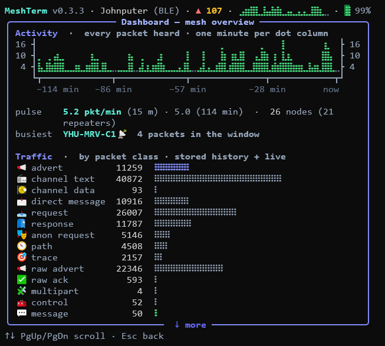
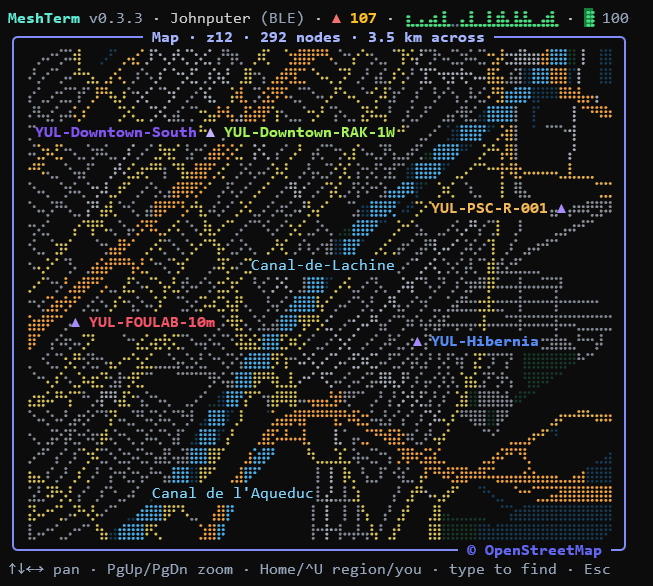
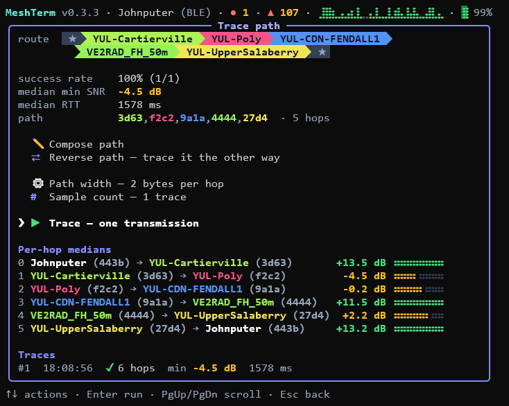
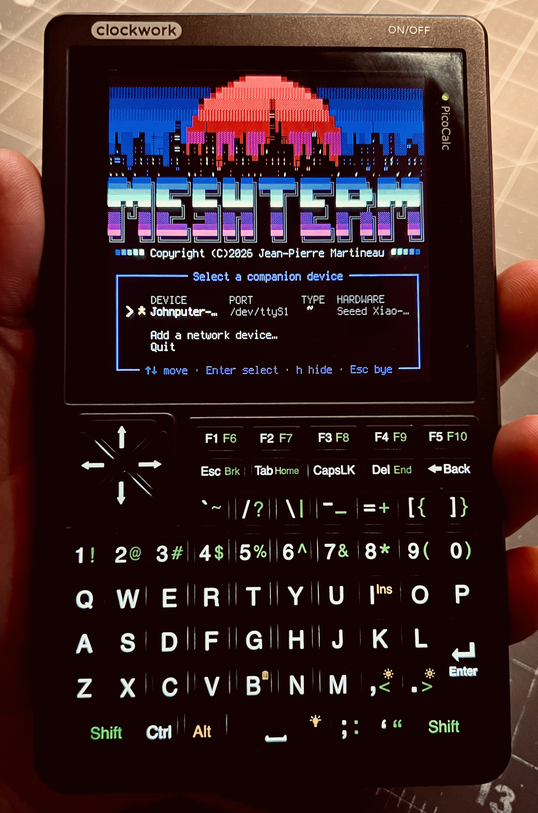

# MeshTerm

**A full-screen terminal companion for [MeshCore](https://meshcore.io/) LoRa mesh
devices** — tune your radio, chat across the mesh, watch the network live, and keep a
longitudinal record of everything you overhear, all from a connected serial, Bluetooth, or
network (TCP) companion.

MeshTerm is interactive by default: a modern, keyboard-driven TUI built on
[Rich](https://github.com/Textualize/rich) and
[prompt_toolkit](https://github.com/prompt-toolkit/python-prompt-toolkit). It is also
fully scriptable — **every screen has a mirror `meshterm` subcommand** — so the same
capabilities drive both an evening of exploring the mesh and a cron job. Every packet the
radio overhears is recorded to a local SQLite database, so the longer you run it, the more
your mesh's history is worth.

<p>
  <a href="https://github.com/jpmartineau/MeshTerm/actions/workflows/ci.yml"></a>
  
  <a href="LICENSE"></a>
  
  
  <a href="https://github.com/jpmartineau/MeshTerm/releases/latest"></a>
  <a href="https://discord.gg/AZwe5Uvb3S"></a>
</p>

> MeshTerm is a side project, not a product. Bug reports are very welcome — but please
> open an issue before writing a pull request. [More on how it's run](#how-this-project-is-run).

<!--
  Screenshots to take — PNG, a 72-column window, the dark theme — saved under
  docs/screenshots/ with these names, and the four links below come alive:
    dashboard.png   the dashboard on a live mesh: heard-age heat, the braille timelines
    map.png         the map zoomed on a handful of nodes, basemap under them
    trace.png       a trace result with its route drawn as chips
    picocalc.png    a photo of the app on the PicoCalc's 53x26 console
-->
<p align="center">
  
  
</p>
<p align="center">
  
  
</p>

---

## Why MeshTerm

- **One tool, two faces.** Launch `meshterm` for a full-screen menu; pass a subcommand for
  a scripted one-shot. The registry that builds the menu builds the CLI, so they never
  drift apart.
- **It remembers.** A passive monitor logs every overheard advert and telemetry frame —
  SNR, RSSI, shared location — to SQLite from the moment the radio opens. Maps, contact lists,
  charts, and the Time Machine all read back that history.
- **It measures.** Live trace with per-hop reliability, a coarse→refine→verify TX-power
  sweep, and a walkable graph of how the mesh actually hangs together.
- **It talks.** Live channel and direct messaging, store-and-forward courier delivery for
  contacts that aren't there yet, and shareable channels as QR codes and `meshcore://` links.
- **It connects however your companion does.** Serial (USB), Bluetooth LE, or TCP (a WiFi
  board or a network proxy) — the discoverable transports are auto-found and picked
  interactively, a network device is named by hand, and every kind reconnects live when a link
  drops. No radio? A built-in simulator covers development.
- **It works offline.** The street map caches OpenStreetMap tiles to disk and falls back to
  a blank grid when there's no network — it never needs the internet to run.

## Install

### Download a build

**[⬇ Latest release](https://github.com/jpmartineau/MeshTerm/releases/latest)** — one file,
no Python needed. Windows, macOS (Intel and Apple silicon), and Linux (x64 and ARM64, so
the uConsole is covered).

MeshTerm is a terminal program, so **open a terminal and run it from there.** You can
double-click it and it will work, but you'll get whatever console your system picks, and
if anything goes wrong at startup the window closes before you can read why.

**Windows** — open Windows Terminal or PowerShell, `cd` to your downloads, then:

```powershell
.\meshterm-0.3.3-windows-x64.exe
```

**macOS and Linux** — open Terminal, `cd` to your downloads, then:

```bash
chmod +x meshterm-0.3.3-*
./meshterm-0.3.3-*
```

### A word about terminals, on Windows

MeshTerm is drawn with emoji icons, braille charts and powerline path chips. Whether you
see them is up to your *terminal*, not really your font: a modern terminal, asked for a
character its font doesn't have, quietly borrows it from another font on the machine.
That's why the app looks right in Windows Terminal, in VS Code's terminal, and on macOS
and Linux — usually with a font that contains almost none of it.

The classic Windows console — the black `cmd.exe` window you get from a double-click —
doesn't borrow. It draws what its one font holds and empty boxes for everything else, and
no font fixes the icons there: the only two fonts on a Windows machine with emoji in them
are proportional, and a console won't take a proportional font.

So when MeshTerm lands in that console it just **moves to Windows Terminal** — it says
so, and opens there. Nothing is installed and nothing is changed; it's one window instead
of another, and it's the whole app exactly as the screenshots show it. Windows Terminal is
already on every Windows 11 machine and is a free install on Windows 10.

Where there's no Windows Terminal to move to, MeshTerm offers the next best thing instead
— the charts and marks, without the icons. It ships
[Cascadia Mono PL](https://github.com/microsoft/cascadia-code), Microsoft's own console
font and one of the very few monospace faces that carries braille at all, and will install
it just for you: no administrator rights, nothing downloaded. If you already have Cascadia
it simply switches to it.

Preferences → Display → Console setup turns all of this off if you'd rather stay put.

Rename it to something you don't mind typing and put it somewhere on your `PATH`, and it
becomes just `meshterm` from anywhere.

> **Your system will complain the first time, and it's right to.** These builds aren't
> code-signed — signing costs real money on both platforms and this is a free side
> project.
>
> - **macOS**: *"cannot be opened because the developer cannot be verified"*. Clear it with
>   `xattr -d com.apple.quarantine meshterm-0.3.3-*` and run it again.
> - **Windows**: *"Windows protected your PC"*. Click **More info → Run anyway**.
>
> Every release ships a `SHA256SUMS` file if you'd rather check the download first.

> **Trying a build without touching your real data.** MeshTerm keeps everything in
> `~/.meshterm` — your history database, contacts, channel keys — and *every* copy of
> MeshTerm uses that same folder. Set `MESHTERM_HOME` to try one in isolation:
>
> ```bash
> MESHTERM_HOME=~/meshterm-test ./meshterm-0.3.3-*      # macOS, Linux
> ```
> ```powershell
> $env:MESHTERM_HOME = "$HOME\meshterm-test"; .\meshterm-0.3.3-windows-x64.exe
> ```
>
> Same variable if you run two radios and want them kept apart.

### Or install with pip

You need **Python 3.10 or newer**. That's the only requirement — MeshTerm pulls in
everything else itself.

```bash
pip install git+https://github.com/jpmartineau/MeshTerm
meshterm
```

`meshterm` opens the full-screen menu. That's the whole install.

**Rather not touch your system Python?** [pipx](https://pipx.pypa.io/) puts the app in its
own private environment and still gives you a plain `meshterm` command:

```bash
pipx install git+https://github.com/jpmartineau/MeshTerm
```

**No radio yet?** `meshterm --mock` runs the entire app against a simulated mesh, so you
can have a look around before you buy anything.

### Coming

**`pip install mesh-term`**, once the package is published. It isn't yet — the name
question is still being sorted out ([why](https://github.com/pypi/support/issues/12162)).

Setting up for development instead? That's in [CONTRIBUTING.md](CONTRIBUTING.md).

## Quick start

```bash
# Interactive full-screen menu (auto-discovers serial + Bluetooth companions)
meshterm

# Connect over Bluetooth (address from `meshterm devices`)
meshterm --ble AA:BB:CC:DD:EE:FF info

# Connect over the network to a TCP companion (host[:port], port defaults to 5000)
meshterm --tcp 192.168.1.50 info

# No radio attached? Use the built-in simulator for development.
meshterm --mock

# On a ClockworkPi PicoCalc (Luckfox Lyra / Calculinux) the handheld flavour is
# auto-detected: a 53-column layout, a 16-slot palette, a compact glyph language on a
# custom console font, and an F-key hint lane. Preview it anywhere, or inspect it:
meshterm --mock --platform picocalc
meshterm specimen
```

Putting MeshTerm on that handheld — the console font, the boot services, a soldered radio for
it, and the bridge that fronts a uConsole's SPI LoRa chip as a companion — is
[`scripts/`](scripts/), and **[`docs/hardware.md`](docs/hardware.md) is its manual**.

## Features

MeshTerm's menu answers one question — *what would you like to do?* — so its five
sections are named for the doing, not the subject. Every interactive screen is listed
here with its scripted equivalent, where one exists.

### 💬 Message — the people on the other end

| Feature | What it does | Scripted |
| --- | --- | --- |
| **💬 Chat** | Live full-screen channel and direct messaging — a scrolling transcript with a pinned input line where sent and received messages stream together. Every message is logged; unread counts show in the menu header. | `meshterm chat send / history / list` |
| **📻 Channels** | Create, join, reorder, mute, and share mesh channels — with QR codes and `meshcore://` share links. | `meshterm channels list / add / join / import / share / clear` |
| **📨 Courier** | Store-and-forward outbox for contacts that aren't reachable yet. Queue a message; it goes out (with ack tracking and polite exponential backoff) the moment the contact is next heard, or at a scheduled time. | `meshterm courier queue / list / send / cancel / clear` |
| **👥 Contacts** | This node and its known contacts — a recency heat-map, overheard packet counts, and full public keys with the path-hash prefix highlighted. The scripted listing is the contacts alone (this node is `meshterm info`'s answer, in far more detail). | `meshterm contacts` |

### 📊 Watch — what the mesh is doing, and what it did

| Feature | What it does | Scripted |
| --- | --- | --- |
| **📊 Dashboard** | The live mesh overview: a two-hour all-packet activity chart with a pulse line, session traffic tallies by packet class, and window RF health beside the radio's own live numbers. Repaints every second. | — |
| **📰 Live feed** | Every packet as it arrives, newest first: time, what the frame *is* (its parsed payload class), and what it is *about* — the node for an advert, the channel for a channel text, sender → recipient for a direct message or a request, the tag for a trace — with reception quality beside it. Enter opens any row in the packet viewer, route graph and all. | — |
| **🚨 Watchtower** | A passive sentinel over the nodes you star: silence alarms when a watched node goes quiet, SNR-sag warnings when reception degrades, recovery notes when it returns, and a heads-up when a never-before-seen node appears. Runs in the background all session; unacked alerts show as a header badge. | — |
| **⏳ Time machine** | Everything the recorder ever heard, as braille charts: reception volume, the median-SNR band, hour-of-day rhythm, packets and nodes per day, and first-ever arrivals — over a switchable 24h / 7d / 30d / all-time window, per node or mesh-wide. | — |
| **🎧 Monitor** | Passive recording is always on in the app. On the CLI, capture a bounded foreground window, tailing each overheard packet and summarising when it ends. It transmits nothing — it only listens. | `meshterm monitor --seconds 60` |

### 🧭 Explore — where the nodes are and how they reach each other

| Feature | What it does | Scripted |
| --- | --- | --- |
| **🌍 Map** | Located nodes plotted over a real OpenStreetMap street basemap rendered as Unicode braille (streets, rivers, place names). Pannable and zoomable; repeaters highlighted and drawn on top. Falls back to a blank grid offline. | — (a map is a picture; `meshterm contacts` lists the same nodes) |
| **🌐 Mesh walk** | The mesh's *observed shape*, walked one node at a time: an evidence graph built from trace walks, firmware routes, overheard relay chains, and repeater neighbour tables. SNR-coloured braille edges, quality bars, Enter to walk, ⌫ to backtrack, type to find any node. The map answers *where*; the walk answers *how it hangs together*. | — |
| **🎯 Trace target** | A live trace screen: pick a target and watch each trace stream in hop by hop, with running per-hop medians and reliability. Compose or force a route through specific repeaters. A trace transmits **exactly once** (repeaters can blacklist nodes that burst) — sample more by running it again. | `meshterm trace --target …` |
| **👣 Trace path** | The other half of tracing: compose the whole circuit by hand — out and back whichever way you choose — and walk it. The path composer suggests each next hop from the links actually observed, strongest first, and can fetch a repeater's neighbour table over the mesh when you hold its admin password. | `meshterm trace-path --path …` |
| **🏆 Trophy case** | Every trace that comes home is scored, on seven boards: longest distance, farthest node, longest single leg, most nodes (with and without revisits), weakest surviving link, and biggest enclosed loop. Records are kept per hash width, and a record walk must be a *trail* — no link crossed twice the same way. | `meshterm records` |

### 🔧 This node — the radio in your hand

| Feature | What it does | Scripted |
| --- | --- | --- |
| **📋 Device info** | The connected companion's identity and full radio configuration at a glance. | `meshterm info` |
| **🔧 Device config** | Every setting the companion firmware exposes — name, radio, client repeat, auto-add, telemetry, custom variables — *staged* for review and applied in place, plus the operations on the box itself: clock sync, TOML backup/restore, the identity key, reboot, and factory reset, each acting the moment it's confirmed, with destructive ops gated. Laid out like Repeater admin, so the radio in your hand and one over the mesh are configured the same way. | `meshterm config` / `config set <key> <value>` / `config backup` / `reboot` / … |
| **📡 Send advert** | Announce this node to the mesh — a zero-hop or flood advertisement, or share this node's contact card as a QR code. | `meshterm config advert` / `config share` |
| **🔌 Device discovery** | Enumerate serial *and* Bluetooth LE companions, pick one interactively (or auto-select the only one present), add a network (TCP) companion by host:port, and remember the last good default. A dropped link is detected live and offers to reconnect. | `meshterm devices` |

### 🗼 Other nodes — someone else's radio, over the mesh

| Feature | What it does | Scripted |
| --- | --- | --- |
| **🗼 Repeater admin** | Set up remote repeaters and room servers over the mesh: log in (remembered or prompted password), then a config-style editor speaking the node's text CLI — including repeater-only knobs (TX delay, airtime factor, advert intervals) — plus one-shot actions and a readline remote command line. | `meshterm repeater-admin <node> <command…>` |
| **📶 TX optimize** | Sweep a remote node's transmit power live — coarse, then refine, then verify — watch each level land, and decide whether to apply the winner. | `meshterm tx-optimize --path … [--apply]` |

## CLI cookbook

Nearly every menu option is also a subcommand — ideal for scripting, cron, and bots. The
live pictures stay in the menu, where their meaning is (the map, dashboard, live feed,
watchtower and mesh walk); everything else has a command, and every command speaks
`--json`. **[`docs/cli.md`](docs/cli.md) is the full manual**: every command and option,
what each one prints on both faces, and the exit statuses. A taste:

```bash
# Trace — a trace transmits exactly once; run it again to sample more.
meshterm trace --target Alice --profile yagi

# Force a route through specific repeaters (MeshCore-app style): comma-separated
# contact names and/or hex key prefixes, mixed freely. Blank lets the device route.
meshterm trace --target Alice --path "3d,f2,3d"
meshterm trace --target Alice --path "3d,Bravo-Repeater,f2"

# Walk a composed circuit with no target at all — out and back your own way
meshterm trace-path --path "3d,f2,3d"

# Sweep and apply a remote node's TX power
meshterm tx-optimize --path "Bravo-Repeater,Alice" --samples 6 --step 3 --apply

# Messaging: the live transcript is a menu screen; the CLI takes a subcommand
meshterm chat send --to Alice "on my way"      # direct message
meshterm chat send --channel 0 "net in 5"      # channel broadcast
meshterm chat history --to Alice
meshterm chat list

# Store-and-forward: queue for a contact that's offline right now
meshterm courier queue Alice "ping me when you're back" --at 18:30
meshterm courier list                 # the outbox — waiting and finished
meshterm courier send 3               # force one delivery attempt now

# Remote repeater admin (one transmission per invocation)
meshterm repeater-admin Bravo-Repeater "get name"

# Device configuration: view, set, back up, restore
meshterm config                       # show all current settings, one `key value` per line
meshterm config get name              # just the value, ready for $(...)
meshterm config set radio_sf 9        # change one setting
meshterm config backup node.toml      # archive every setting to TOML
meshterm config restore node.toml --dry-run
meshterm config advert-cadence 2      # auto-advert to neighbours every 2 h (0 = off)
meshterm config advert-cadence 24 --flood   # flood the wider mesh daily

# Passive capture window (records to history; transmits nothing)
meshterm monitor --seconds 60
```

Global options — `--profile/-p`, `--port`, `--ble`, `--ble-pin`, `--tcp`, `--mock`,
`--db`, `--json`, `--absolute`, `--quiet/-q` — may be typed **before or after** the
subcommand: `meshterm contacts --json` and `meshterm --json contacts` are the same run.

### Two output faces

*(The short version — [`docs/cli.md`](docs/cli.md) has the whole of it.)*

The **plain face** is for a person at a prompt. It prints like a standard Unix utility —
no colour, no borders, one record per line, nothing wrapped — and it is allowed to be
comfortable about it: listings are `ps`-style aligned records with **bare names**
(alignment is the delimiter), times are **relative ages** (`now`, `5m`, `never`), and a
route is drawn with arrows — `MockCompanion (00) → Yagi-Repeater (a1) → Alice (d4)`.
`--absolute` swaps every age back for an ISO-8601 instant. A *path*, the spec `--path`
takes back, stays comma-separated hex. `-` is the one token for absent. Errors,
acknowledgements and progress all go to stderr, so a redirect catches only the answer.

The **JSON face** is the machine contract, and `--json` works on **every** command:

```console
$ meshterm contacts --json | jq -r '.[] | select(.node.type == "repeater") | .node.key'
b2c3d4e500000000000000000000000000000000000000000000000000000000
a1b2c3d400000000000000000000000000000000000000000000000000000000
```

No envelope — an array for a listing, an object for a set of facts. One compact line;
`monitor` and `chat listen` stream one document per record. Values are typed, absent is
`null` and never an omitted key, and timestamps are always UTC to the second regardless of
`--absolute`. `--json` changes the rendering, never the report: same records, same exit
status.

Anything structural should go through `--json` and `jq`. The plain face is for looking at.

### Exit status

`0` success · `1` failure · `2` usage error · `3` no device found (nothing was
transmitted) · `4` the device was reached but the operation failed · `5` nothing to
report. The table with its full wording is printed under `meshterm --help` and explained
in [`docs/cli.md`](docs/cli.md#exit-status).

`5` is the one worth knowing about: it lets a script tell "found nothing" from "worked"
without counting output lines.

```bash
if meshterm contacts > contacts.txt; then
    echo "$(wc -l < contacts.txt) contacts"
elif [ $? -eq 5 ]; then
    echo "no contacts yet"
fi
```

## Configuration

Two files, two jobs — and you need neither to run.

**Preferences** are how MeshTerm behaves: the pause it leaves between transmissions, how
hard it retries a message, how far back it keeps history, how a map frames itself. Every one has a built-in default, so change them only where you disagree — from
the **Preferences** page in the menu (grouped, staged, saved by one action at the bottom),
or from a shell:

```console
$ meshterm preferences show                 # every preference, its value, its default
$ meshterm preferences set history_days 90
$ meshterm preferences reset --yes          # back to the built-in defaults
```

They are kept in `~/.meshterm/preferences.toml`, which lists only what you have changed;
delete a line and the default takes over again.

**Config** is where things live and which device to talk to. MeshTerm runs with none of it
— it discovers attached serial devices and nearby Bluetooth companions, lets you pick one,
and remembers the last good default. A network (TCP) companion isn't discoverable, so reach
it with `--tcp host:port`, a TCP profile, or the picker's "add a network device" prompt.
Write a config file only to give your hardware stable aliases.

Copy [`config.example.toml`](config.example.toml) to `~/.meshterm/config.toml`:

```toml
default_profile = "s3"
connect_on_start = true   # false opens the radio link lazily instead of at launch

[profiles.s3]
port = "COM5"
baudrate = 115200
default_tx_power = 20
description = "XIAO ESP32-S3 + Wio SX1262 serial companion"

# A Bluetooth LE companion: give it an `address` instead of a `port`.
[profiles.handheld]
address = "AA:BB:CC:DD:EE:FF"
# ble_pin = "123456"   # only if your device requires a pairing PIN
description = "Pocket handheld over Bluetooth"

# A network (TCP) companion: give it a `host` (and optional `tcp_port`, default 5000).
[profiles.wifi]
host = "192.168.1.50"
description = "Basestation over WiFi"
```

Both live in `~/.meshterm`, along with everything else MeshTerm remembers: the SQLite
history, the outbox, the contact and channel caches, stored admin passwords, and the log.
**`$MESHTERM_HOME` moves the whole directory**, which is the way to run a second radio —
or a `--mock` session — without touching the one you use every day. `--db` moves the
database alone; the rest stays where it was. [`docs/cli.md`](docs/cli.md#where-meshterm-keeps-its-state)
lists every file.

Timestamps are stored as UTC and rendered in your local time. History older than the
`history_days` preference is pruned once at session start.

## Architecture

MeshTerm is layered so a new feature is one file in `meshterm/tools/`:

```
cli.py        Typer app; no subcommand -> interactive menu
context.py    AppContext (console, config, repository, device) dependency container
core/         Domain: models, preferences + device profiles, connection abstraction (+ mock)
tools/        Pluggable "menu options"; each self-registers and gets logging for free
services/     Background algorithms (monitor, trace, tx search, courier, watchtower) — no UI
persistence/  SQLite schema, repository, structured logging
ui/           Rich theme/widgets + the full-screen TUI (screens, dialogs, map, chat)
```

Adding a feature means subclassing `Tool`, decorating it with `@register`, and
implementing `run()`. The same registry builds both the CLI and the menu, and the base
class wraps every execution in a logged `runs` row automatically.

## How this project is run

MeshTerm is one person working evenings and weekends. I'd rather tell you that up front
than have you guess from how long things take.

**Issues are welcome — all of them.** Bugs, questions, "is this supposed to do that". The
[bug form](.github/ISSUE_TEMPLATE/bug.yml) asks for a fair bit, and that's on purpose: how
well a problem is described really does decide whether I can do anything with it. If I can
reproduce it, I'll usually chase it. If I can't, I'm mostly guessing.

**Ask before you write a pull request.** Open an issue first and wait for a yes. I'm not
being precious — MeshTerm has firm house rules about how screens get built (they're in
[CLAUDE.md](CLAUDE.md)), and I'd hate for you to spend a weekend on something I then ask
you to rewrite. A quick conversation first saves us both.

**I can't promise timelines.** Some things get fixed the same night. Some sit for a month
because life happened. If your issue goes quiet, a nudge is completely fine — it's not
rude, it's helpful.

**Where to report things.** Either works:

- **[GitHub issues](https://github.com/jpmartineau/MeshTerm/issues)** if you have an
  account. This is where things get tracked and fixed, so it's the shortest path.
- **[Discord](https://discord.gg/AZwe5Uvb3S)** if you don't, or if you're not sure it's a
  bug yet. Ask in the support forum, or drop reproducible defects in `#bugs`. I move the
  real ones over to GitHub myself.

Don't worry about picking the wrong one. Getting told about a problem beats filing it
tidily.

Also here: [CONTRIBUTING.md](CONTRIBUTING.md) ·
[SECURITY.md](SECURITY.md) ·
[CODE_OF_CONDUCT.md](CODE_OF_CONDUCT.md) ·
[CHANGELOG.md](CHANGELOG.md)

## Development

```bash
pip install -e ".[dev]"
python -m pytest -q       # tests
ruff check .              # lint
ruff format .            # format
```

Screens are designed to stay readable at **72 columns**.

Want to send a pull request? See [CONTRIBUTING.md](CONTRIBUTING.md) first.

## Acknowledgements & attribution

MeshTerm stands on the [MeshCore](https://meshcore.io/) project — its firmware and the
`meshcore` Python companion library are what make talking to the radio possible.

### Map data

The street map is rendered from **© OpenStreetMap contributors** data, served as vector
tiles by [OpenFreeMap](https://openfreemap.org/) on the unmodified
**© OpenMapTiles** [schema](https://openmaptiles.org/). OpenStreetMap data is available
under the [Open Database License (ODbL)](https://www.openstreetmap.org/copyright). Tiles
are decoded with a small built-in reader for the
[Mapbox Vector Tile](https://github.com/mapbox/vector-tile-spec) format.

Both map surfaces carry the credit themselves. The full-screen map opens with
`© OpenMapTiles · Data from OpenStreetMap` in its bottom-right corner and collapses it to
`© OpenStreetMap` once you pan, zoom or type — set into the panel's bottom border rule on
a desktop terminal, so the drawing itself keeps every cell, and on the map's own last row
on the PicoCalc, whose frame has no bottom rule. The node page's location preview shows the
short form throughout. The About page inside the app spells out the licence URL.

### Bundled font

MeshTerm ships **Cascadia Mono PL**, © 2019–present Microsoft Corporation, redistributed
unmodified under the [SIL Open Font License 1.1](meshterm/assets/fonts/CascadiaMono-OFL.txt).
It's offered to Windows users whose console can't draw the charts — see
[A word about terminals, on Windows](#a-word-about-terminals-on-windows). Microsoft doesn't endorse MeshTerm; the font is
simply the right tool, being one of the very few monospace faces that carries the braille
block the timelines are drawn from.

### Open-source dependencies

MeshTerm is built with these libraries; each is used under its own license (see the
respective project for the authoritative terms):

| Library | Role | License |
| --- | --- | --- |
| [meshcore](https://pypi.org/project/meshcore/) | Companion-device protocol (serial / BLE) | MIT |
| [pycryptodome](https://www.pycryptodome.org/) | AES/HMAC for decrypting overheard channel packets | BSD-2-Clause / Public Domain |
| [pyserial](https://github.com/pyserial/pyserial) | Serial-port enumeration and I/O | BSD-3-Clause |
| [bleak](https://github.com/hbldh/bleak) | Bluetooth LE scanning + connection | MIT |
| [Typer](https://typer.tiangolo.com/) | Scripted CLI (subcommands mirror the menu) | MIT |
| [Rich](https://github.com/Textualize/rich) | Console rendering | MIT |
| [prompt_toolkit](https://github.com/prompt-toolkit/python-prompt-toolkit) | Full-screen interactive TUI | BSD-3-Clause |
| [markdown-it-py](https://github.com/executablebooks/markdown-it-py) | CommonMark parser behind the written About pages | MIT |
| [Segno](https://github.com/heuer/segno) | Pure-Python QR codes (channel share links) | BSD-3-Clause |
| [tomli](https://github.com/hukkin/tomli) / [tomli-w](https://github.com/hukkin/tomli-w) | TOML config, preferences and device-config backups | MIT |

## License

Copyright © 2026 Jean-Pierre Martineau.

MeshTerm is open source under the [Apache License, Version 2.0](LICENSE) — free to
use, modify, and redistribute, commercially or otherwise. The "MeshTerm" name and any
associated logo are trademarks reserved by the author and aren't covered by the code
license (see [NOTICE](NOTICE)); a redistributed fork should go by its own name. The
donate link built into the app supports this project and its original author —
forks that keep soliciting through it without redirecting it to themselves aren't
affiliated with this project.

The bundled font is **not** covered by that license. `meshterm/assets/fonts/CascadiaMonoPL.ttf`
is Microsoft's Cascadia Mono PL, redistributed unmodified under the SIL Open Font License
1.1, which travels with it as
[CascadiaMono-OFL.txt](meshterm/assets/fonts/CascadiaMono-OFL.txt) and stays its only
license.

Each standalone build carries `LICENSE`, `NOTICE` and a generated `THIRD-PARTY-NOTICES.txt`
(every dependency's own license text) inside the archive, and the same three files sit
beside the downloads on the [releases page](https://github.com/jpmartineau/MeshTerm/releases)
so you don't have to extract one just to read them.
